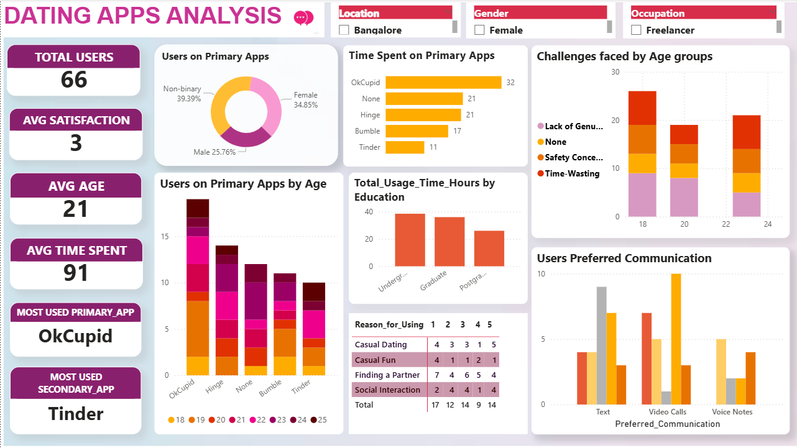

# 💘 Dating Apps Analysis - Power BI Project

This project analyzes data collected from a survey of 66 users regarding dating app usage, preferences, challenges, and satisfaction levels. The insights are visualized using Power BI.

## 📊 Dashboard Highlights
- Most used apps: **OkCupid**, **Tinder**
- Avg Age: 21 | Avg Time Spent: 91 minutes
- Diverse gender representation: Female, Male, Non-binary
- Top reasons for using apps: **Finding a Partner**, **Casual Dating**
- Challenges: Lack of genuine people, time-wasting, safety concerns

## 📂 Files
- `Dating Apps DB.pbix`: Power BI dashboard
- `GenZ_DatingApp_Data.csv`: Raw dataset used for analysis
- `dashboard.png`: Snapshot of the final dashboard

## 📌 Tools Used
- Power BI
- DAX
- Data Cleaning & Transformation

## 🧠 Insights
- Undergrads are most active on dating apps
- OkCupid dominates across age groups
- Safety and trust are major concerns among younger users

## 📸 Preview

## 📬 Contact
If you like this project, feel free to connect or suggest improvements!
